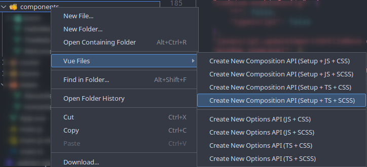
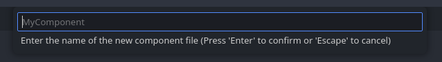
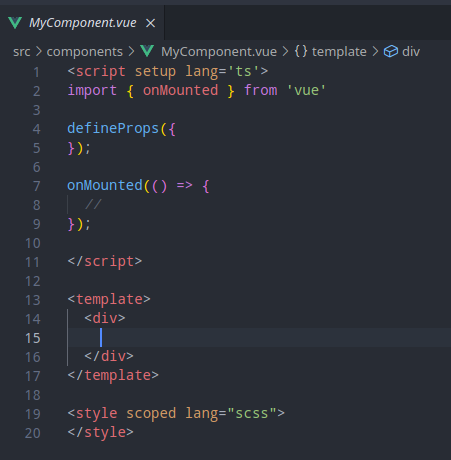

# VSCode Vue Files

[](https://github.com/K-eL/vscode-vue-files/actions/workflows/ci.yml)
[](https://codecov.io/gh/K-eL/vscode-vue-files)
[](https://marketplace.visualstudio.com/items?itemName=K-eL.vscode-vue-files)

This extension allows you to quickly create new Vue files filled with some boilerplate content depending on your preferences.

> Inspired by Angular Files (https://github.com/ivalexa/vscode-angular2-files)

## Features

Right-click inside your explorer panel or over a folder to open "Vue Files" menu option.

You will find many options to choose how you want to create your new file.

---

> 1- Right-click on a folder and choose the template you want



---

> 2- Choose the name of your file (extension not needed)



---

> 3- Enjoy your easily created Vue Component file



## Extension Settings

You can add these options to your VS Code Settings to have a better experience (check the current default value on the right side):

**Menu Options**

These configs enable/disable the corresponding menu options, all enabled by default:

```
"vscode-vue-files.menu.showCompositionApi": true,
"vscode-vue-files.menu.showOptionsApi": true,
"vscode-vue-files.menu.showTypescript": true,
"vscode-vue-files.menu.showJavascript": true,
"vscode-vue-files.menu.showCss": true,
"vscode-vue-files.menu.showScss": true
```

**File Structure**

If true, places the `script` tag at the top of the new files, otherwise, the `template` tag comes at the top. It's **false** by default (`template` first).

```
"vscode-vue-files.fileStructure.scriptTagComesFirst": false
```

**File Template**

If true, generates a functional V-Model template inside the newly generated file (Props, Emits, and Computed options must be enabled to be functional).

```
"vscode-vue-files.template.showV-ModelTemplate": true
```

**File Options**

These settings show/hide the corresponding options in the newly generated files:

```
"vscode-vue-files.option.showNameScriptOption": true,
"vscode-vue-files.option.showComponentsScriptOption": true,
"vscode-vue-files.option.showDirectivesScriptOption": false,
"vscode-vue-files.option.showExtendsScriptOption": false,
"vscode-vue-files.option.showMixinsScriptOption": false,
"vscode-vue-files.option.showProvideInjectScriptOption": false,
"vscode-vue-files.option.showInheritAttributesScriptOption": false,
"vscode-vue-files.option.showPropsScriptOption": true,
"vscode-vue-files.option.showEmitsScriptOption": true,
"vscode-vue-files.option.showSetupScriptOption": false,
"vscode-vue-files.option.showDataScriptOption": true,
"vscode-vue-files.option.showComputedScriptOption": true,
"vscode-vue-files.option.showWatchScriptOption": true,
"vscode-vue-files.option.showMethodsScriptOption": true
```

**Life Cycle Hooks**

These settings show/hide the corresponding life-cycle hooks in the newly generated files.

```
"vscode-vue-files.lifecycle.showLifecycleHooksScriptOptions": true,
"vscode-vue-files.lifecycle.showBeforeCreateScriptOption": false,
"vscode-vue-files.lifecycle.showCreatedScriptOption": false,
"vscode-vue-files.lifecycle.showBeforeMountScriptOption": false,
"vscode-vue-files.lifecycle.showMountedScriptOption": true,
"vscode-vue-files.lifecycle.showBeforeUpdateScriptOption": false,
"vscode-vue-files.lifecycle.showUpdatedScriptOption": true,
"vscode-vue-files.lifecycle.showActivatedScriptOption": false,
"vscode-vue-files.lifecycle.showDeactivatedScriptOption": false,
"vscode-vue-files.lifecycle.showBeforeUnmountScriptOption": true,
"vscode-vue-files.lifecycle.showUnmountedScriptOption": false,
"vscode-vue-files.lifecycle.showErrorCapturedScriptOption": false,
"vscode-vue-files.lifecycle.showRenderTrackedScriptOption": false,
"vscode-vue-files.lifecycle.showRenderTriggeredScriptOption": false
```

## Disclaimer

> **Important:** This extension due to the nature of it's purpose will create
> files on your hard drive and if necessary create the respective folder structure.
> While it should not override any files during this process, I'm not giving any guarantees
> or take any responsibility in case of lost data.

## License

MIT

## Donate

💚 If you find this extension useful, I'd be very happy if you support me [here](https://www.buymeacoffee.com/c.thor)! 😃

**Enjoy!**
