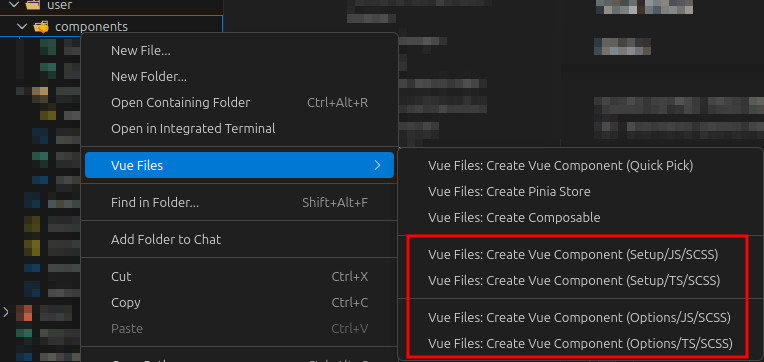
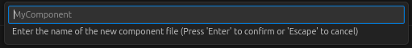
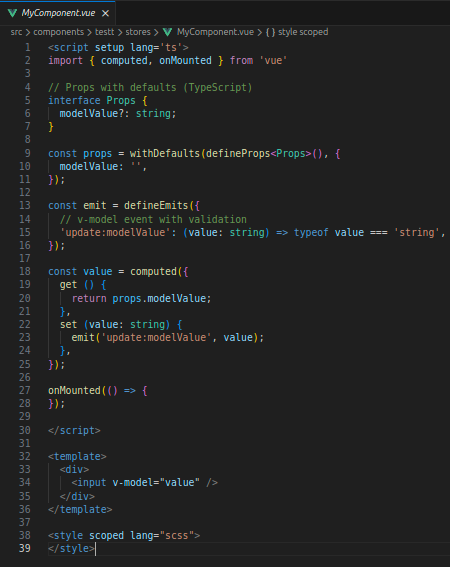
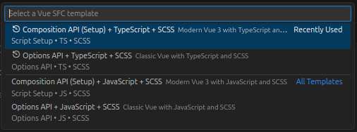
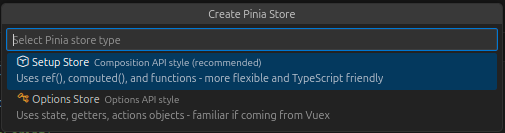
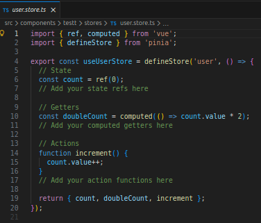
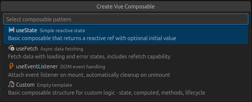
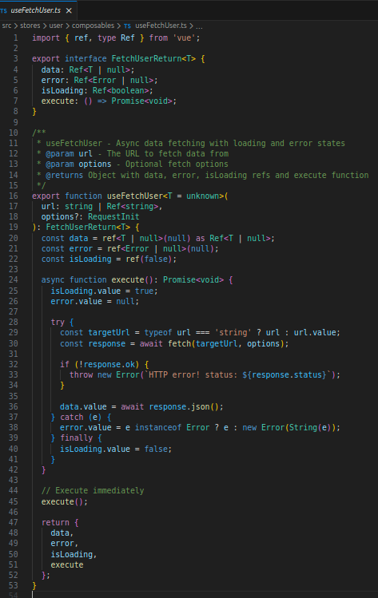

# VSCode Vue Files

[](https://github.com/K-eL/vscode-vue-files/actions/workflows/ci.yml)
[](https://codecov.io/github/K-eL/vscode-vue-files)
[](https://marketplace.visualstudio.com/items?itemName=K-eL.vscode-vue-files)

This extension allows you to quickly create new Vue files filled with customized boilerplate content, including **Vue Components**, **Pinia Stores**, and **Composables**.

> Inspired by Angular Files (https://github.com/ivalexa/vscode-angular2-files)

## Features

Right-click inside your explorer panel or over a folder to open the "Vue Files" menu option.

You will find many options to choose how you want to create your new file.

### Vue Components

Create Vue Single File Components (SFC) with customizable templates supporting both Composition API and Options API.

---

> 1- Right-click on a folder and choose the template you want



---

> 2- Choose the name of your file (extension not needed)



---

> 3- Enjoy your easily created Vue Component file as you wanted it!



---

#### Quick Pick

Use the **Quick Pick** command for a faster workflow with recently used templates.



---

### Pinia Stores

Create Pinia stores with two available styles:

- **Setup Store** (Composition API style - recommended)
- **Options Store** (Options API style - similar to Vuex)

Stores are automatically created in a `stores/` subfolder and include example state, getters, and actions.




---

### Composables

Create Vue 3 composables with four available patterns:

| Pattern              | Description                                   |
| -------------------- | --------------------------------------------- |
| **useState**         | Simple reactive state management with ref     |
| **useFetch**         | Async data fetching with loading/error states |
| **useEventListener** | DOM event listener with automatic cleanup     |
| **Custom**           | Empty composable template for custom logic    |

Composables are automatically created in a `composables/` subfolder with TypeScript support.




---

## Extension Settings

You can add these options to your VS Code Settings to customize your experience.

### Menu Options

These configs enable/disable the corresponding menu options, all enabled by default:

```json
"vscode-vue-files.menu.showCompositionApi": true,
"vscode-vue-files.menu.showOptionsApi": true,
"vscode-vue-files.menu.showTypescript": true,
"vscode-vue-files.menu.showJavascript": true,
"vscode-vue-files.menu.showCss": true,
"vscode-vue-files.menu.showScss": true
```

---

### Framework Detection

Automatically detect the Vue framework (Nuxt, Vite, Vue CLI) from your `package.json`:

```json
"vscode-vue-files.framework.autoDetect": true,
"vscode-vue-files.framework.override": "none"
```

| Option       | Values                            | Description                              |
| ------------ | --------------------------------- | ---------------------------------------- |
| `autoDetect` | `true` / `false`                  | Enable automatic framework detection     |
| `override`   | `none`, `nuxt`, `vite`, `vue-cli` | Manually override the detected framework |

---

### Vue SFC: File Structure

If true, places the `script` tag at the top of the new files, otherwise, the `template` tag comes at the top. It's **false** by default (`template` first).

```json
"vscode-vue-files.fileStructure.scriptTagComesFirst": false
```

---

### Vue SFC: Templates

If true, generates a functional V-Model template inside the newly generated file (Props, Emits, and Computed options must be enabled to be functional).

```json
"vscode-vue-files.template.showV-ModelTemplate": true
```

---

### Vue SFC: Script Setup Macros

Configure Vue 3.3+ and 3.4+ compiler macros for `<script setup>`:

```json
"vscode-vue-files.scriptSetup.useDefineModel": true,
"vscode-vue-files.scriptSetup.useWithDefaults": true,
"vscode-vue-files.scriptSetup.showDefineOptions": false,
"vscode-vue-files.scriptSetup.showDefineExpose": false,
"vscode-vue-files.scriptSetup.showDefineSlots": false
```

| Option              | Default | Description                                            |
| ------------------- | ------- | ------------------------------------------------------ |
| `useDefineModel`    | `true`  | Use `defineModel()` (Vue 3.4+) for v-model bindings    |
| `useWithDefaults`   | `true`  | Use `withDefaults()` with `defineProps` for TypeScript |
| `showDefineOptions` | `false` | Include `defineOptions()` macro (Vue 3.3+)             |
| `showDefineExpose`  | `false` | Include `defineExpose()` macro                         |
| `showDefineSlots`   | `false` | Include `defineSlots()` macro (Vue 3.3+)               |

---

### Vue SFC: Options API

These settings show/hide the corresponding options in the newly generated files:

```json
"vscode-vue-files.option.showNameScriptOption": true,
"vscode-vue-files.option.showComponentsScriptOption": true,
"vscode-vue-files.option.showDirectivesScriptOption": false,
"vscode-vue-files.option.showExtendsScriptOption": false,
"vscode-vue-files.option.showMixinsScriptOption": false,
"vscode-vue-files.option.showProvideInjectScriptOption": false,
"vscode-vue-files.option.showInheritAttributesScriptOption": false,
"vscode-vue-files.option.showPropsScriptOption": true,
"vscode-vue-files.option.showEmitsScriptOption": true,
"vscode-vue-files.option.showSetupScriptOption": false,
"vscode-vue-files.option.showDataScriptOption": true,
"vscode-vue-files.option.showComputedScriptOption": true,
"vscode-vue-files.option.showWatchScriptOption": true,
"vscode-vue-files.option.showMethodsScriptOption": true
```

---

### Vue SFC: Life Cycle Hooks

These settings show/hide the corresponding life-cycle hooks in the newly generated files:

```json
"vscode-vue-files.lifecycle.showLifecycleHooksScriptOptions": true,
"vscode-vue-files.lifecycle.showBeforeCreateScriptOption": false,
"vscode-vue-files.lifecycle.showCreatedScriptOption": false,
"vscode-vue-files.lifecycle.showBeforeMountScriptOption": false,
"vscode-vue-files.lifecycle.showMountedScriptOption": true,
"vscode-vue-files.lifecycle.showBeforeUpdateScriptOption": false,
"vscode-vue-files.lifecycle.showUpdatedScriptOption": true,
"vscode-vue-files.lifecycle.showActivatedScriptOption": false,
"vscode-vue-files.lifecycle.showDeactivatedScriptOption": false,
"vscode-vue-files.lifecycle.showBeforeUnmountScriptOption": true,
"vscode-vue-files.lifecycle.showUnmountedScriptOption": false,
"vscode-vue-files.lifecycle.showErrorCapturedScriptOption": false,
"vscode-vue-files.lifecycle.showRenderTrackedScriptOption": false,
"vscode-vue-files.lifecycle.showRenderTriggeredScriptOption": false
```

---

### Pinia Stores

Configure Pinia store generation:

```json
"vscode-vue-files.pinia.defaultStoreType": "setup",
"vscode-vue-files.pinia.createInStoresFolder": true,
"vscode-vue-files.pinia.includeExamples": true
```

| Option                 | Default   | Description                                                              |
| ---------------------- | --------- | ------------------------------------------------------------------------ |
| `defaultStoreType`     | `"setup"` | Default store type: `setup` (Composition API) or `options` (Options API) |
| `createInStoresFolder` | `true`    | Automatically create stores in a `stores/` subfolder                     |
| `includeExamples`      | `true`    | Include example state, getters, and actions in generated stores          |

---

### Composables

Configure composable generation:

```json
"vscode-vue-files.composables.createInComposablesFolder": true,
"vscode-vue-files.composables.useTypeScript": true
```

| Option                      | Default | Description                                                    |
| --------------------------- | ------- | -------------------------------------------------------------- |
| `createInComposablesFolder` | `true`  | Automatically create composables in a `composables/` subfolder |
| `useTypeScript`             | `true`  | Generate composables with TypeScript types and generics        |

---

## Disclaimer

> **Important:** This extension, due to the nature of its purpose, will create
> files on your hard drive and if necessary create the respective folder structure.
> While it should not override any files during this process, I'm not giving any guarantees
> or take any responsibility in case of lost data.

## License

MIT

## Donate

💚 If you find this extension useful, I'd be very happy if you support me [here](https://www.buymeacoffee.com/c.thor)! 😃

**Enjoy!**
